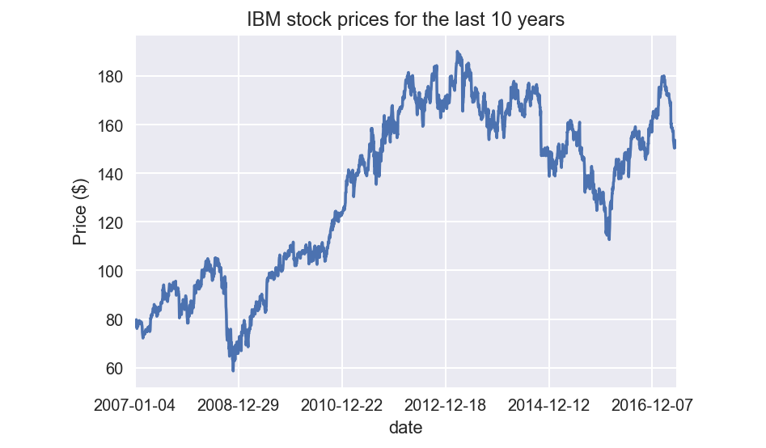
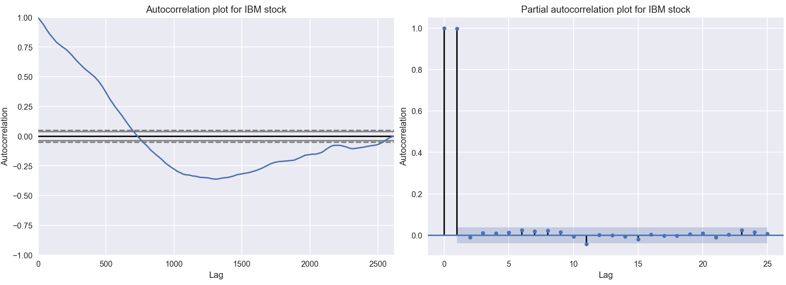
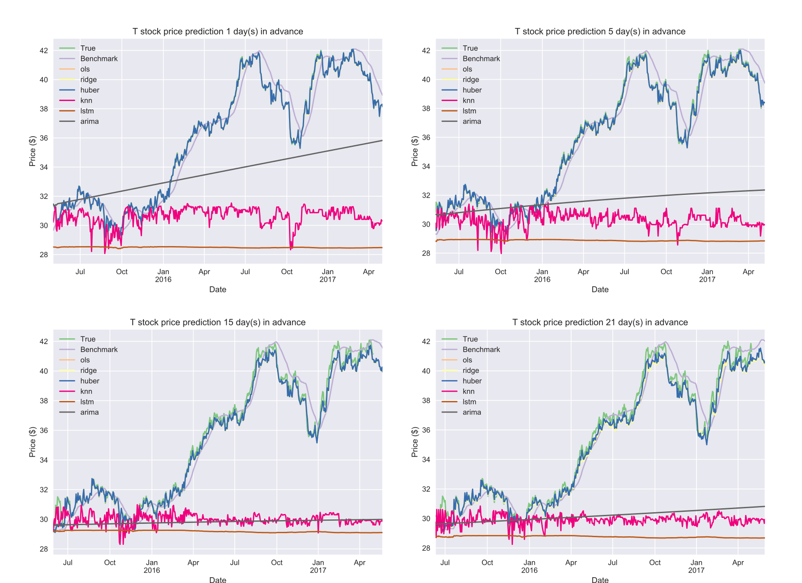
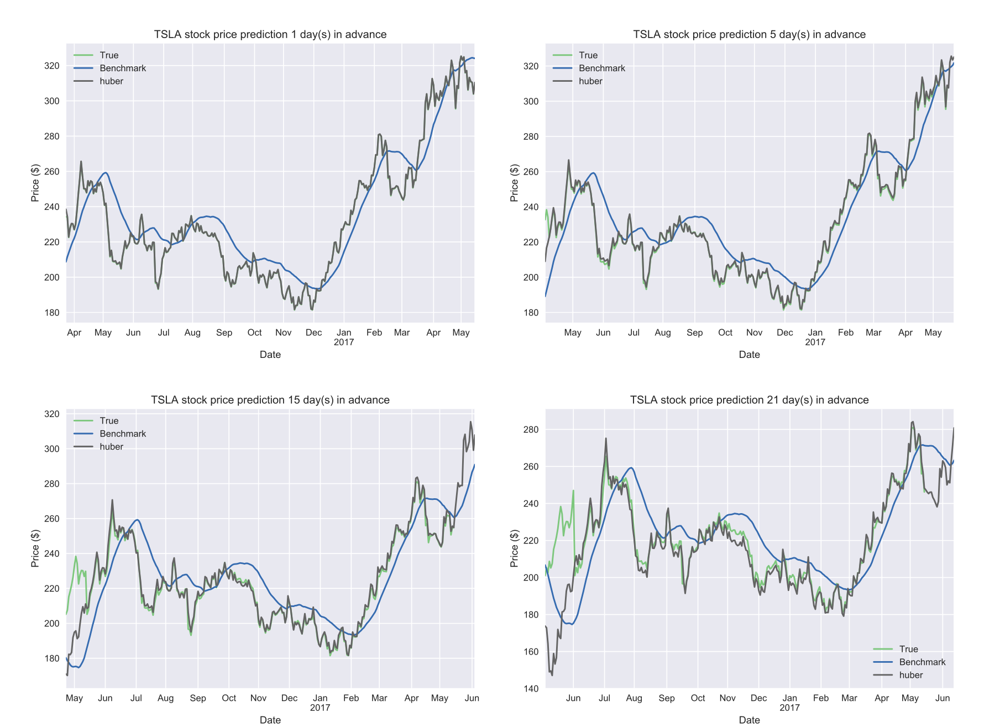

# I. Definition

## Project Overview

Statistical models and machine learning have been used in various domains,
ranging from baseball player performance prediction to stock prediction.
In the latter case, investment firms, hedge funds and small investors develop
or follow financial models to understand and, to some extend, predict market
behavior to make profitable investments.

In this project we will exploit the wealth of historical stock data available
on the Internet to solving the problem of predicting stock prices. In doing so,
we will investigate the performance of various models for predicting stock
prices for publicly-traded American companies. The data we want to predict
looks like the one presented in Figure \ref{ibm-stock}, which shows the
close price[^1] for IBM stock for the last 10 years.

[^1]: The close price is the price of the stock at the end of a business day.
  As will be made clear later, we do not use the exact close price, but
  a metric derived from it.



More specifically, the data consists of tables containing, for each stock, for
each day: the opening price, the highest price, the lowest price, the close
price and the number of transactions. The objective is to use this data to make
predictions for stock prices $N$ days in advance, with $N$ in the range $[1, 5,
10, 21]$. An excerpt of the data is shown below[^2].

|date        | open   | high   | low     | close |      volume |
|------------|--------|--------|---------|-------|-------------|
|2006-01-03  | 82.45  | 82.55  | 80.810  | 82.06 |  11715100.0 |
|2006-01-04  | 82.20  | 82.50  | 81.330  | 81.95 |   9832800.0 |
|2006-01-05  | 81.40  | 82.90  | 80.999  | 82.50 |   7213400.0 |
|2006-01-06  | 83.95  | 85.03  | 83.410  | 84.95 |   8196900.0 |
|2006-01-09  | 83.90  | 84.25  | 83.380  | 83.73 |   6851100.0 |

[^2]: Notice there is a jump from 2006-01-06 to 2006-01-09. That is due to the
  fact we only record data for weekdays, and not weekends.

## Problem Statement

The problem tackled by this project is that of predicting stock prices for
future dates given historical data about such stock items. Inputs will contain
multiple metrics, such as opening price (Open), highest price the stock traded
at (High), how many stocks were traded (Volume) and closing price adjusted for
stock splits and dividends (Adjusted Close). The objective in this project is
to predict the Adjusted Close price. The simplest solution would be to predict
the mean value of the adjusted close price, but clearly we can strive to do
better than that.

One might wonder why predict for Adjusted Close instead of just the close
price. There are at least two reasons to use an adjusted value instead of the
raw one:

 1. When individual stocks become too expensive, the company may want to split
    stocks, reducing the individual price of a single stock. When that happens,
    the price will drop, making prediction harder. For example, if an algorithm
    was trained when a given stock cost around $ 100, but then there is a split
    of 2, now each stock item costs $ 50, and the previous training data
    becomes "useless". More information on this topic can be found [at
    Wikipedia](https://en.wikipedia.org/wiki/Stock_split).

 2. Some stocks pay [dividends](https://en.wikipedia.org/wiki/Dividend) at
    previously-determined dates. Due to that, demand for such stock increases
    as the dividend payment date approaches, artificially inflating the stock
    price. After the dividends are paid, the stock price converges once again
    to its actual price.

Due to the aforementioned reasons, we work with adjusted stock prices, by
working backwards in time updating prices considering splits and dividends. One
consequence of applying such a method, though, is that the adjusted prices of
*all* stock items will change when a dividend or split is found. Therefore, when
new data arrives, models may have to be retrained. Also, models should output
predicted adjusted close prices in dollars (a real number).

All the major providers (examples include [Yahoo!
Finance](https://finance.yahoo.com) and [Quandl](https://www.quandl.com/)) of
historical stock data already provide adjusted stock prices. Hence, no
computation is needed on our part to compute adjusted values.

### Feature Engineering

Although we don't *have* to compute adjusted prices, we can augment our data by
computing useful statistics. In this project we will focus on the following
ones:

 1. The *rolling mean* gives us the average value of a stock in the last $n$
    days (in this project we will use $n=21$, roughly a month in business
    days);
 2. Bollinger bands and metrics derived from it, such as
    [*bandwidth*](https://en.wikipedia.org/wiki/Bollinger_Bands#Indicators_derived_from_Bollinger_Bands)
    and %b, in the hope of identifying opportunities in the valuation of
    a stock;
 3. [*Momentum*](https://en.wikipedia.org/wiki/Momentum_(finance)), which
    indicates the trend of a given stock;
 4. [*Volatility*](https://en.wikipedia.org/wiki/Volatility_(finance)), which
    represents the degree of variation of a trading price over time;
 5. [*Beta*](https://en.wikipedia.org/wiki/Beta_(finance)), which indicates
    whether a stock is more or less volatile than the market as a whole[^3].

[^3]: Since we do not have data about the whole market, in this project we will
  use the S&P 500 prices as a proxy for the performance of the market as
  a whole.

As can be seen from the references, all of the aforementioned features are used
in finance, and seem to be relevant to the problem.

## Metrics

Since this is a regression problem, for we are predicting a single number, we
should use a metric that works correctly with regressions. Initially, it was
thought that mean squared error would be a good metric, but it only allows the
ordering of the quality of models within one dataset. In short: the mean
squared error (and even the root mean squared error) is larger or shorter
depending on the magnitude of values.

For the reasons above, we will be using the [*coefficient of
determination*](https://en.wikipedia.org/wiki/Coefficient_of_determination), or
$R^2$ as the performance measurement metric. The $R^2$ score has the advantage
of being independent of magnitude of the data and of being standardize, where
1 is the score of a model that perfectly fits the data.

# II. Analysis

## Data Exploration and visualization

For obtaining the data we used the [Quandl
API](https://pypi.python.org/pypi/Quandl) and we downloaded the data for the
last ten years for the following tickers: 'IBM' (IBM), 'GOOG' (Google), 'AAPL'
(Apple), 'TSLA' (Tesla), 'BA' (Boeing), 'MSFT' (Microsoft), 'T' (AT&T), 'AIR'
(AAR Corp.) and 'FDX' (Fedex). For obtaining the data about S&P 500 we used the
Yahoo! Finance interface for download, since this data is not available in the
free plan of Quandl.

As already mentioned, the data is tabular, and has one row for each weekday.
Given that the downloaded stock are from different markets, they have very
different characteristics. Consider, for example, the table below, that
compares 'AIR' stock with 'TSLA' stock. Although 'TSLA' is a younger stock than
'AIR' by 1129 days (in this dataset), when 'TSLA' stock became available, it
was valued roughly the same as 'AIR' (Figure \ref{five-stock}). Notwithstanding
that, from 2012 on, 'TSLA' valuation is much higher than 'AIR'. Even more
interesting is that, being AIR a provider of services and products to the
commercial aviation market, it is subject to some seasonality, which is
reflected in its historic stock prices. Evidence of that can be seen in Figure
\ref{five-stock} and in the table below, as the mean for AIR is close to its
median value. It is worthy noting that the standard deviation of 'AIR' is
relatively low, also suggesting some stability in prices, while the standard
deviation of 'TSLA' is more than five times the mean of 'AIR'.

|Statistic           | 'AIR'   | 'TSLA'  |
|--------------------|---------|---------|
| Count              | 2870.00 | 1741.00 |
| Mean               |   22.64 |  137.17 |
| Standard Deviation |    5.85 |   97.11 |
| Minimum            |    9.56 |   15.80 |
| 25%                |   17.76 |   30.19 |
| 50%                |   23.20 |  167.01 |
| 75%                |   26.54 |  223.41 |
| Maximum            |   38.49 |  325.22 |

As alluded previously, Figure \ref{five-stock} shows the behavior of five
stocks in the dataset. (Tesla only started being publicly-traded in June 2010,
so we only have values for dates later than that.) The stocks shown are
examples of companies from many segments, such as technology, logistics,
commercial aviation and defense, and an automotive industry. Interestingly
enough, we can see a trend in 2008, where all stock prices fell, showing
graphically one of the effects of the recession of the late 2000s. Even more
interesting is the apparent stationarity of prices for 'AIR'.


To better appreciate the difference between the adjusted and non-adjusted
prices of stock, one is directed to Figure \ref{apple-stock}. In the Figure, on
the left, one can see that at some point in 2014 there was a sharp price drop
in the Apple stock price due to share splits. This sharp change does not happen
in the image on the right, due to the split being taken into account when
computing prices.


### Autocorrelation

[Autocorrelation](https://en.wikipedia.org/wiki/Autocorrelation) measures the
similarity between observations of a variable as a function of the time lag
between them. When we make an autocorrelation plot of stock data, we can see
the data has a significant autocorrelation for many time steps (which means the
data at time $t$ is "influenced" by data in earlier time steps), suggesting the
use of an autoregressive model is a valid approach.

When we plot the autocorrelation of a stock (Figure \ref{ibm-autocorrelation},
left), we see a slowly-decaying autocorrelation, which suggests the data can be
generated by an autocorrelated model. Also, when we look at a partial
autocorrelation plot of a stock (Figure \ref{ibm-autocorrelation}, right), we
see the autocorrelation drops abruptly after a differencing of one, suggesting
that, after accounting for the daily difference of stock prices, the
distribution of the data becomes stationary.



### Ethics of using such data

We believing using, predicting and publishing results with stock data is
harmless for a simple reason: stocks prices represent information known by the
whole market about *publicly-traded* companies. Therefore, any data analysis
results derived from it can be used without worry.

## Algorithms and Techniques

Being the task of predicting stock prices a regression task, we have many
algorithms at our disposal. Since it is impractical to use them all, we will
evaluate the problem with four classes of algorithms:

 * K-nearest neighbors: this is a simple model that keeps all the training data
   around for prediction. Since our data has the granularity of days, even for
   a dataset with 10 years' worth of data, we are talking about an upper bound
   of 365 · 10 = 3650 points. Hardly a problem for modern computers.

 * Generalized linear models: ordinary least squares, Ridge regression and
   Huber regression. These are also very simple models that should be
   investigated for, if they can explain the data well enough, their simplicity
   will allow good generalization.

 * [ARIMA](https://en.wikipedia.org/wiki/Autoregressive_integrated_moving_average)
   (autoregressive integrated moving average) models are used to model time
   series and can be worth a try.

 * [LSTM](https://en.wikipedia.org/wiki/Long_short-term_memory) (long short-term
   memory neural network) models are deep learning models that also model well
   time-series data and can be tried to check whether they fit the data well.

One might question why should ARIMA or LSTM models be used in this problem.
This question can be answered when we look at the
[autocorrelation](https://en.wikipedia.org/wiki/Autocorrelation) of the data.
The ARIMA model has components for differencing and identifying
autocorrelation. Hence, it can be an appropriate model. LSTM models were made
to exploit temporal relationships in the data and, hence, are good candidates
for this task.

Prior to training the models, though, we have to pre-process our data to
represent our input variables and our output variables. So, after obtaining our
data and computing the additional features we mentioned in the Feature
Engineering section, we have to build our dataset. This is done by a function
that constructs an X matrix of our features and an y vector of our target
variable. The target variable is always the adjusted close price. So, the only
thing that varies in our y vector is how many days in advance we want to
predict. In this project we will use offsets of 1 (one business day), 5 (a week
in business days), 15 (three weeks in business days) and 21 (the average number
of business days in a month).

To determine the best parameters for each model we will perform a grid search
cross-validation process.

## Benchmark

The simplest model that makes some sense is the mean of stock prices.
A slightly better model would be one that outputs the *rolling* mean value of
the stock. I will compare my model's performance with the rolling mean output
of the last month.  Since means output the same unit of the input data, the
benchmark model also outputs its values in dollars.

The rolling mean makes sense because it averages out the volatility of the
stock, but still changes over time.

# III. Methodology

## Data Preprocessing

The first preprocessing step needed is calculating the adjusted stock prices.
Since this is already done by financial data providers, there is not much for
us to worry about.

As mentioned before, the data is augmented by computing features based on the
adjusted close of previous dates and its relationship with S&P 500 for the beta
index. We do so by implementing and calling the `augment` function, which takes
a dataframe holding our data and a dataframe holding the S&P 500 data and
outputs a dataframe with the new data; it also modifies the dataframe in place,
but the returned one removes not-a-number elements that are added due to the
calculations done by the augmentation process.

\scriptsize

```python
def augment(dataframe, benchmark=None, column='adj_close', window=21):
    'Augments a dataframe with the statistics found in this module.'

    rm = rolling_mean(dataframe[column], window)
    rstd = rolling_std(dataframe[column], window)
    bw = bandwidth(rm, rstd)
    pb = percent_bollinger(dataframe[column], rm, rstd)
    dv = momentum(dataframe[column], window)
    v = volatility(dataframe[column])

    dataframe['sma'] = rm
    dataframe['bandwidth'] = bw
    dataframe[r'%b'] = pb
    dataframe['momentum'] = dv
    dataframe['volatility'] = v

    if benchmark is not None:
        dataframe['beta'] = beta(dataframe[column], benchmark[column])

    return dataframe.ix[TRADING_DAYS_IN_YEAR:]
```

\normalsize


Also, the training data is built by adding, to each point, the stock value
n days in the future. This is achieved by the `build_dataset` function
presented below:

\scriptsize

```python
def build_dataset(values, shift=1, price_column=0, lookback=0):
    '''Builds a training dataset.

    :param values: The values to read from (dataframe).
    :param shift: How far into the future we want to look.
    :param price_column: The column that contains the adjusted close price.
    :param lookback: How many points from the past we want to include.
    '''
    x, y = [], []

    lines = len(values) - shift
    columns = values.shape[1] if len(values.shape) > 1 else None

    for i in range(lookback, lines - shift):
        # This is *not* an off-by-one error. Assume you have a list of one
        # element, that i=0 and lookback=0:
        # >>> a = [1]
        # >>> a[0-0:0+1]
        # >>> [1]
        x.append(values[i-lookback:i+1])
        if price_column == 'all' or columns is None:
            y.append(values[i+shift])
        else:
            y.append(values[i+shift, price_column])

    if lookback:
        x = np.array(x)
        y = np.array(y)
    else:
        x = np.array(x).reshape((-1, columns if columns else 1))
        y = np.array(y).reshape((-1, columns if columns else 1))

    return x, y
```

\normalsize

After the dataset is built, we use
[`MinMaxScaler()`](http://scikit-learn.org/stable/modules/generated/sklearn.preprocessing.MinMaxScaler.html)
to normalize the data to be between [0, 1].

## Implementation

We implemented the following pipeline:

 1. Data loading
 2. Data augmentation
 3. Dataset building
 4. Splitting data into training and test sets
 5. Cross-validation of models
 6. Prediction with test data

Data loading is implemented with the Quandl API and subsequent loading data
from disk. This part will not be detailed, as it is not as interesting as the
other parts of the pipeline. Data augmentation and dataset building were
already discussed in the previous section. The data separation and model
implementation parts will be discussed in this section, while the
cross-validation and final evaluation will be deferred to the next sections.

### Training, validation and Test data

To make sure model development was correct and happened without peeking at
"future data", I separated 20% of the data as a test dataset. The other 80% of
the data was used as training and validation dataset. The cross-validation was
carried out with the help of sklearn's
[`TimeSeriesSplit`](http://scikit-learn.org/stable/modules/generated/sklearn.model_selection.TimeSeriesSplit.html).

`TimeSeriesSplit` is a variation of k-fold cross-validation. In the k-th split,
it returns the first k folds as training set and the (k+1)-th fold as a test
set. An important aspect of this cross-validation method is that successive
training sets are supersets of those that come before them.

### sklearn models

The knn and generalized linear models come from sklearn and, as such, were
implemented as class instantiations in the code. Where the ordinary least
squares model is an instance of [`LinearRegression()`](http://scikit-learn.org/stable/modules/generated/sklearn.linear_model.LinearRegression.html), Ridge regression is
an instance of [`Ridge()`](http://scikit-learn.org/stable/modules/generated/sklearn.linear_model.Ridge.html#sklearn.linear_model.Ridge) and Huber regression is an instance of
[`HuberRegressor()`](http://scikit-learn.org/stable/modules/generated/sklearn.linear_model.HuberRegressor.html#sklearn.linear_model.HuberRegressor).

### Other models

Initially I had implemented the LSTM as a class that inherited from sklearn's
`BaseEstimator` and `RegressorMixin` classes, but I did not know how sklearn
re-parameterized the models. Later I found out that Keras already includes an
sklearn regressor and I refactored the code to make use of it. Basically,
I needed to define a function that built my model and pass it to
`KerasRegressor`, which implements the interfaces expected by sklearn.

The LSTM model built in Keras was implemented as a wrapper function called
`build_lstm`. `build_lstm` supports different stochastic gradient
descent-derived models and builds an LSTM with arbitrary number of layers,
hidden memory cells and sequence lengths. A simplified version of the actual
code will be presented below. The `input_dim` parameters tells the LSTM how
many features a single input has. The `input_length` parameter defines how
many time steps are input to the LSTM. The `output_dim` tells the LSTM how many
features we are predicting (usually just one, the adjusted close price). The
other parameters are neural network-specific and define dropout probability,
number of neurons in each layer, how many layers the network has, the loss
function to use and the optimizer to use.

\scriptsize

```python
def build_lstm(input_dim=1, input_length=1, output_dim=1, dropout=.4,
               hidden_size=32, layers=3, loss='mse', optimizer='nadam'):
    if layers < 2:
        raise ValueError('LstmRegressor must have at least two layers.')

    model = Sequential()

    model.add(LSTM(input_shape=(input_length, input_dim), units=hidden_size,
                   return_sequences=True))
    model.add(Dropout(dropout))

    for _ in range(layers - 2):
        model.add(LSTM(hidden_size, return_sequences=True))
        model.add(Dropout(dropout))

    model.add(LSTM(hidden_size, return_sequences=False))
    model.add(Dropout(dropout))

    model.add(Dense(units=output_dim))
    model.add(Activation('linear'))

    model.compile(loss=loss, optimizer=optimizer)

    return model
```

\normalsize

The ARIMA model was implemented using `statsmodels`. For it to follow the
sklearn interface, we implemented a wrapper class that inherited from
`BaseEstimator` and `RegressorMixin`. To omit some details an recalling that
the model has three parameters (autoregression order, autoregression
differentiation and moving average order), we present simplified versions of
the fit and predict methods:

\scriptsize

```python
def fit(self, X, y):
    'Updates the model using the stored X and y arrays.'

    self.model = ARIMA(
        y,
        order=(self.n_ar_params, self.n_ar_diffs, self.n_ma_params)
    )
    self.model_fit = self.model.fit(disp=0)

    return self

def predict(self, X):
    'Makes forecasts'

    if not self.model_fit:
        raise NotFittedError("This %(name)s instance is not fitted "
                             "yet" % {'name': type(self).__name__})

    return self.model_fit.forecast(len(X))[0]
```

\normalsize

One important aspect of ARIMA models is that predictions become unreliable the
farther away you move from the last time step used for training. For that
reason, to predict in a test set comprising of many time steps (in our case
more than an year's time), ARIMA models must be refit from time to time. This
makes them extremely slow to evaluate. Hence, while exploring parameter values,
we did not refit the model (nor did we show in the excerpt above how the refit
is implemented, directing the reader to the source code).

## Refinement

As aforementioned, we implemented various models. All models were optimized by
performing a cross-validated parameter search. The search was performed for
each individual ticker (stock name). Hence, each ticker can have its own
optimized set of parameters for the models.

### Grid Search CV parameters

In this section we describe the parameters used for searching for the best
models.

#### Ordinary Least Squares (ols)

\scriptsize

```python
grid = [{'normalize': [True, False], 'fit_intercept': [True, False],
         'n_jobs': [-1]}]
```
\normalsize

#### Ridge Regression (ridge)

\scriptsize

```python
grid = [{'alpha': [1.0, 10.0, 0.1, 0.01], 'normalize': [True, False],
         'fit_intercept': [True, False]}]
```
\normalsize

#### Huber Regression (huber)

\scriptsize

```python
grid = [{'epsilon': [1.1, 1.35, 1.5], 'max_iter': [10, 100, 1000],
         'fit_intercept': [True, False]}]

```
\normalsize

#### K-nearest Neighbors (knn)

\scriptsize

```python
grid = [{'n_neighbors': [1, 3, 5, 10], 'weights': ['uniform', 'distance'],
         'p': [1, 2], 'n_jobs': [-1]}]
```
\normalsize

#### ARIMA (arima)

We searched for AR = [1, 3, 5, 10], I = [0, 1, 2], MA = [0, 1, 5].

#### LSTM (lstm)

\scriptsize

```python
grid = [
    {
        'input_length': [length], 'dropout': [0.2, 0.5, 0.8],
        'hidden_size': [32, 64], 'input_dim': [X.shape[1]],
        'layers': [2, 3], 'optimizer': 'adam nadam rmsprop'.split(),
    },
]
```

\normalsize

### Model adaptations

Training the LSTM was particularly complicated due to the number of parameters
and the time it takes to train an LSTM. Also, since we only own one GPU, this
was essentially a sequential task. Due to that, for *searching for the best
parameters* what I did was to reduce the number of epochs to something more
manageable and, once the best parameters were found, I increased the number of
epochs again. So, to find the LSTM parameters, we decided to do
a [`GridSearchCV`](http://scikit-learn.org/stable/modules/generated/sklearn.model_selection.GridSearchCV.html#sklearn.model_selection.GridSearchCV)
with few epochs (25) to, then, train an optimized model with more epochs. We
obviously are making the assumption that models that perform better in 25
epochs will also perform better in more epochs, which seems plausible, but
probably is not the case.

Also, since the ARIMA model was implemented with `statsmodels`, we had to
implement our own sequential version of parameter search. The sequential aspect
of the function is not a big problem because the ARIMA implementation uses
scipy and numpy to implement its linear algebra operations, and our
implementation of numpy and scipy use the Intel Math Kernel Library® as LAPACK
implementation and it was configured to use a number of threads equal to the
number of cores in the evaluation computer.

### Performance

If one takes a look at the performance of the algorithms, summarized on the
table at the end of this section and Figure \ref{T-perf}, one will be able to
see that the linear models are unbeatable. It is particularly interesting that
models that are appropriate for modeling time series (such as ARIMA and LSTMs)
did not perform well in this task. The reason for ARIMA not performing well is
that, in the way it is implemented, it disregards information other than the
adjusted close prices to make predictions and it uses forecast values as input
for new forecasts (making one at a time), which explains the mostly-straight
lines shown in the figures.

To improve the ARIMA performance, one could retrain the model every time a new
prediction was made, but preliminary experiments showed that this approach is
computationally-intensive and would dominate by a large extent, the amount of
computation done in this project. Due to that, ARIMA models will be ignored
from now on.



|Ticker | Shift | OLS    | Ridge  | Huber  | Knn       | LSTM        | ARIMA      | Benchmark |
|-------|-------|--------|--------|--------|-----------|-------------|------------|-----------|
| APPL  | 1     | 0.9886 | 0.9884 | 0.9887 |*0.5203*   |*-17.0420*   |*-4.0723*   | 0.8741    |
| APPL  | 5     | 0.9390 | 0.9380 | 0.9388 |*0.3579*   |*-31.8449*   |*-4.0612*   | 0.8039    |
| APPL  | 15    | 0.7699 | 0.7671 | 0.7645 |*0.2820*   |*-40.0810*   |*-4.0681*   | 0.5734    |
| APPL  | 21    | 0.6233 | 0.6183 | 0.6192 |*0.2287*   |*-40.7763*   |*-4.0891*   | 0.3759    |
| AIR   | 1     | 0.9896 | 0.9896 | 0.9897 |*0.6736*   |*-0.4376*    |*-5.4981*   | 0.9091    |
| AIR   | 5     | 0.9378 | 0.9366 | 0.9394 |*0.3591*   |*-0.9717*    |*-109.0892* | 0.8558    |
| AIR   | 15    | 0.7534 | 0.7519 | 0.7491 |*-1.0982*  |*-2.0955*    |*-5.5199*   | 0.7038    |
| AIR   | 21    | 0.6386 | 0.6462 | 0.6485 |*-1.3803*  |*-2.7057*    |*-5.2811*   | 0.6070    |
| BA    | 1     | 0.9907 | 0.9906 | 0.9907 |*-0.7141*  |*-2057.8908* |*-2.1052*   | 0.9273    |
| BA    | 5     | 0.9466 | 0.9461 | 0.9470 |*-1.2264*  |*-4843.8447* |*-2.3643*   | 0.8798    |
| BA    | 15    | 0.8123 | 0.8016 | 0.8150 |*-1.8076*  |*-6388.6555* |*-3.0886*   | 0.6888    |
| BA    | 21    | 0.6986 | 0.6786 | 0.6968 |*-3.6503*  |*-4059.9665* |*-3.3305*   | 0.4947    |
| FDX   | 1     | 0.9850 | 0.9847 | 0.9850 |*0.3992*   |*-14.2415*   |*-2.5886*   | 0.8481    |
| FDX   | 5     | 0.9180 | 0.9173 | 0.9181 |*0.1958*   |*-24.5070*   |*-5.9925*   | 0.7846    |
| FDX   | 15    | 0.7544 | 0.7518 | 0.7526 |*-0.1386*  |*-12.8465*   |*-2.5180*   | 0.5913    |
| FDX   | 21    | 0.6433 | 0.5885 | 0.6445 |*-0.4886*  |*-11.2130*   |*-3.7567*   | 0.4444    |
| IBM   | 1     | 0.9860 | 0.9859 | 0.9858 |*0.8640*   |*0.7604*     |*-273.1294* | 0.8971    |
| IBM   | 5     | 0.9290 | 0.9287 | 0.9278 |*0.6546*   |*0.6592*     |*-235.0801* | 0.8355    |
| IBM   | 15    | 0.7732 | 0.7666 | 0.7738 |*0.2771*   |*0.2506*     |*-25.9402*  | 0.6811    |
| IBM   | 21    | 0.6608 | 0.6508 | 0.6690 |*0.0707*   |*-0.1858*    |*-7.5973*   | 0.5801    |
| MSFT  | 1     | 0.9915 | 0.9913 | 0.9914 |*-33.5231* |*-4368.6207* |*0.6251*    | 0.9518    |
| MSFT  | 5     | 0.9536 | 0.9530 | 0.9562 |*-58.3890* |*-4911.8961* |*0.7638*    | 0.9218    |
| MSFT  | 15    | 0.8586 | 0.8569 | 0.8677 |*-107.6200*|*-1752.8686* |*-5.2652*   | 0.8463    |
| MSFT  | 21    |*0.7957*|*0.7978*| 0.8192 |*-136.1821*|*-2253.2481* |*-16.7502*  | 0.8002    |
|  T    | 1     | 0.9932 | 0.9930 | 0.9934 |*-118.8841*|*-81107.1910*|*-8.1511*   | 0.9468    |
|  T    | 5     | 0.9643 | 0.9638 | 0.9655 |*-175.3260*|*-32127.9919*|*-128.1239* | 0.9176    |
|  T    | 15    | 0.8805 | 0.8796 | 0.8822 |*-397.1407*|*-15681.8341*|*-4330.8477*| 0.8453    |
|  T    | 21    | 0.8078 | 0.8015 | 0.8136 |*-482.0043*|*-19511.6227*|*-387.8690* | 0.8015    |

With regards to the LSTM models, although they were able to model the overall
trends in the data, they were unable to outperform the linear models, even when
lookback[^4] is implemented. Notice that both an automated and a manual
parameter search were performed with the LSTM models. With an LSTM using
a lookback of 100 (meaning it uses data of the previous 100 business days to
make a prediction) and a hidden LSTM cell size of 128, three layers and
optimized with the Nesterov Adam optimizer, trained with a batch size of 256
for 4000 epochs (such a model trained for approximately three hours on
a GeForce GTX 1070 GPU), we were able to obtain the R^2 scores shown in the
table below for each ticker with a 21 day in advance prediction. So, even with
a considerable amount of training time, we were unable to produce an LSTM that
outperforms the benchmark. Therefore, we conclude that, for this project, the
predictor of choice is the one based on Huber regression.

| Ticker | R^2 Score |
|--------|-----------|
| AAPL   | 0.5349    |
| AIR    | 0.3196    |
| BA     | 0.4879    |
| FDX    | 0.2359    |
| IBM    | 0.5961    |
| MSFT   | 0.8154    |
| T      | 0.8013    |

[^4]: Lookback is the number of points we store and look at when performing
  a prediction. If lookback is 5, for example, we will look at today plus the
  previous four days when performing a prediction.

# IV. Results

## Model Evaluation and Validation

By observing the table above, one can see that the only algorithm that
consistently beats the benchmark[^5] is the Huber Regressor. Therefore, it
should be the model used in further predictions. One of the many advantages of
the Huber Regression model is that it is a linear model, so it is extremely
fast to train and even a cross-validated grid search can be done using the
training data at runtime. Notice that in the table where we show predictor
performance for each predictor, we show the performance in the test set.
Therefore, we already showed performance in unseen data. Still, we can compare
the performance of the Huber regressor with the benchmark on an unseen ticker
(TSLA, for Tesla motors).

\scriptsize

```python
from pystockml import models

for shift in [1, 5, 15, 21]:
    lookback = 0
    ticker = 'TSLA'
    X_train, y_train, X_test, y_test, scaler = models.get_processed_dataset(
        ticker, .8, shift, lookback, False
    )
    _, _, model = models.cross_validate_model('huber', X_train, y_train)
    yhat = model.predict(X_test)
    sma_yhat = models.sma_predictions(X_test)
    print(ticker, shift, models.r2_score(yhat, y_test),
          models.r2_score(sma_yhat, y_test))
```

\normalsize

Consider, for example, the block of code above. The data in the table below
summarizes the results obtained when such a code was executed. As can be seen
from the table, the Huber regressor significantly outperforms the benchmark in
the TSLA ticker.

| Shift | Huber Score | Benchmark Score |
|-------|-------------|-----------------|
| 1     | 0.9799      | 0.7948          |
| 5     | 0.8878      | 0.6163          |
| 15    | 0.4214      | -0.1565         |
| 21    | -0.1433     | -0.5871         |

[^5]: The benchmark is the moving average of the last 21 days of the stock.

From the above discussion, it seems that, for most stocks, the model results
*can* be trusted, especially when predicting a few days in advance. Also, the
model is simple to understand and simple to train, making it a good candidate
for predictions.

## Justification

Although the model seems to be good enough for predicting stock prices,
a significant part of the predictability comes from the autoregressive nature
of the data. So, although the model is better than the benchmark, we can't
claim the problem of predicting stock prices to be solved. An investor that
relied on such a model would probably make a little bit of money for a long
time, but might be still subject to big losses (and gains) in some times.

# V. Conclusion

## Free-Form Visualization

As mentioned above, we also evaluated the model with the TSLA ticker. This is
a particularly interesting dataset because, as shown in Figure
\ref{five-stock}, the stock begins having a very low value for two years,
before gaining value abruptly. Therefore, simplistic models that let themselves
be influenced by that period might have their performance affected negatively.
Notwidthstanding that, the model was able to predict TSLA stock prices
significantly better than the benchmark, as shown in the previous table and in
figure \ref{TSLA-perf}.



## Reflection

In this project we built a stock price predictor that works in an
end-to-end[^6] manner by writing code to download stock price data from Quandl,
doing feature engineering by computing financial statistics on top of the data,
normalizing the data to fall between zero and one, preparing the dataset for
time series prediction, training the model and outputting the prediction.
A sample execution of the prediction script is shown below, where we predict
four days in advance the price of the IBM stock trained from 2010-01-01 to
2011-01-01[^7].

```
$ ./predict.py IBM 2010-01-01 2011-01-01 4
Using TensorFlow backend.
Loading data...
Training model...
Predicting...
Predicted value: 122.515657496
```

[^6]: Although the code is present, the download itself won't work due to the
  lack of a Quandl API key in the repository.

[^7]: The prediction offset is relative to the end date passed into the script.

One striking characteristic of this project is that generalized linear models
performed much better than more complex models. They outperformed even
multilayer perceptron neural networks (not shown in this document), Recurrent
Neural Networks, and ARIMA models. Also is remarkable the fact that even
a simplistic algorithm such as a moving average performs relatively well when
compared to the other more complex models.

A considerable amount of time in the development was devoted to finding a good
LSTM model that could outperform the linear models. This was particularly
frustrating, given the large amount of time it takes to train LSTMs when
compared to the other models discussed. It is also worth mentioning that
building an ARIMA predictor using statsmodels to fit the sklearn API was
complicated, because statsmodels is very different from sklearn. So, the
fit/predict pipeline was not as efficient as it could be, and we were unable to
pickle the model using joblib (an issue we also had with the LSTM model).

Also challenging was structuring the code in a way that could be easily
consumable by client code (in our case, a client script), which involved many
refactorings of the code.

Still, even with these bumps in the road, we have confidence the developed
model could be used in a general setting, *especially* due to its simplicity.
Obviously, if it was integrated into a more complex systems, one would be
required to exercise judgement before taking decisions based on these
predictions. Still, we find such a model could be useful in the real world.

## Improvement

We haven't even scratched the surface of applying machine learning to financial
settings. This implementation could be extended to perform portfolio
allocations, for example, and predicting the performance of such portfolios.
Also, except in experiments with the LSTM model, we train one different model
for each ticker, and more investigations should be made into the viability of
using a single linear model for all stocks.

With regards to data gathering, the code could be improved to support
a configuration file and do automatic data updates to always make predictions
with fresh data.

On the topic of models, initial experiments with boosted models weren't
promising, but a more systematic evaluation could be helpful.  About the LSTM,
an evaluation with differenced data could be made. We didn't investigate it in
this project because such a change would require a refactor.

As a final thought, we find it odd that none of the more complex models could
outperform simple linear models when the data is not linear. Were the Huber
regression model selected as the benchmark, we would have a hard time solving
this problem and would probably have to reimplement major parts of the code in
trying to beat it.
