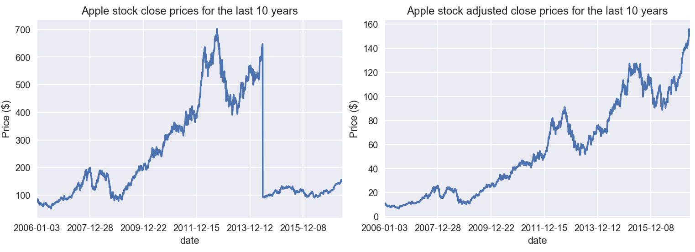

% Machine Learning Engineer Nanodegree Capstone Project: Stock Price Predictor
% Renato L. F. Cunha
% June 07th, 2017

# I. Definition
_(approx. 1-2 pages)_

## Project Overview

Statistical models and machine learning have been used in various domains,
ranging from baseball player performance prediction to stock prediction.
In the latter case, investment firms, hedge funds and small investors develop
or follow financial models to understand and, to some extend, predict market
behavior to make profitable investments.

In this project we will exploit the wealth of historical stock data available
on the Internet to solving the problem of predicting stock prices. In doing so,
we will investigate the performance of various models for predicting stock
prices for publicly-traded American companies. The data we want to predict
looks like the one presented in Figure \ref{ibm-stock}, which shows the
close price[^1] for IBM stock for the last 10 years.

[^1]: The close price is the price of the stock at the end of a business day.
  As will be made clear later, we do not use the exact close price, but
  a metric derived from it.

More specifically, the data consists of tables containing, for each stock, for
each day: the opening price, the highest price, the lowest price, the close
price and the number of transactions. The objective is to use this data to make
predictions for stock prices $N$ days in advance, with $N$ in the range $[1, 5,
10, 21]$. An excerpt of the data is shown below[^2].

|date        | open   | high   | low     | close |      volume |
|------------|--------|--------|---------|-------|-------------|
|2006-01-03  | 82.45  | 82.55  | 80.810  | 82.06 |  11715100.0 |
|2006-01-04  | 82.20  | 82.50  | 81.330  | 81.95 |   9832800.0 |
|2006-01-05  | 81.40  | 82.90  | 80.999  | 82.50 |   7213400.0 |
|2006-01-06  | 83.95  | 85.03  | 83.410  | 84.95 |   8196900.0 |
|2006-01-09  | 83.90  | 84.25  | 83.380  | 83.73 |   6851100.0 |

[^2]: Notice there is a jump from 2006-01-06 to 2006-01-09. That is due to the
  fact we only record data for weekdays, and not weekends.

## Problem Statement

The problem tackled by this project is that of predicting stock prices for
future dates given historical data about such stock items. Inputs will contain
multiple metrics, such as opening price (Open), highest price the stock traded
at (High), how many stocks were traded (Volume) and closing price adjusted for
stock splits and dividends (Adjusted Close). The objective in this project is
to predict the Adjusted Close price. The simplest solution would be to predict
the mean value of the adjusted close price, but clearly we can strive to do
better than that.

One might wonder why predict for Adjusted Close instead of just the close
price. There are at least two reasons to use an adjusted value instead of the
raw one:

 1. When individual stocks become too expensive, the company may want to split
    stocks, reducing the individual price of a single stock. When that happens,
    the price will drop, making prediction harder. For example, if an algorithm
    was trained when a given stock cost around $ 100, but then there is a split
    of 2, now each stock item costs $ 50, and the previous training data
    becomes "useless". More information on this topic can be found [at
    Wikipedia](https://en.wikipedia.org/wiki/Stock_split).

 2. Some stocks pay [dividends](https://en.wikipedia.org/wiki/Dividend) at
    previously-determined dates. Due to that, demand for such stock increases
    as the dividend payment date approaches, artificially inflating the stock
    price. After the dividends are paid, the stock price converges once again
    to its actual price.

Due to the aforementioned reasons, we work with adjusted stock prices, by
working backwards in time updating prices considering splits and dividends. One
consequence of applying such a method, though, is that the adjusted prices of
*all* stock items will change when a dividend or split is found. Therefore, when
new data arrives, models may have to be retrained. Also, models should output
predicted adjusted close prices in dollars (a real number).

All the major providers (examples include [Yahoo!
Finance](https://finance.yahoo.com) and [Quandl](https://www.quandl.com/)) of
historical stock data already provide adjusted stock prices. Hence, no
computation is needed on our part to compute adjusted values.

### Feature Engineering

Although we don't *have* to compute adjusted prices, we can augment our data by
computing useful statistics. In this project we will focus on the following
ones:

 1. The *rolling mean* gives us the average value of a stock in the last $n$
    days (in this project we will use $n=21$, roughly a month in business
    days);
 2. Bollinger bands and metrics derived from it, such as
    [*bandwidth*](https://en.wikipedia.org/wiki/Bollinger_Bands#Indicators_derived_from_Bollinger_Bands)
    and %b, in the hope of identifying opportunities in the valuation of
    a stock;
 3. [*Momentum*](https://en.wikipedia.org/wiki/Momentum_(finance)), which
    indicates the trend of a given stock;
 4. [*Volatility*](https://en.wikipedia.org/wiki/Volatility_(finance)), which
    represents the degree of variation of a trading price over time;
 5. [*Beta*](https://en.wikipedia.org/wiki/Beta_(finance)), which indicates
    whether a stock is more or less volatile than the market as a whole[^3].

[^3]: Since we do not have data about the whole market, in this project we will
  use the S&P 500 prices as a proxy for the performance of the market as
  a whole.

As can be seen from the references, all of the aforementioned features are used
in finance, and seem to be relevant to the problem.

## Metrics

Since this is a regression problem, for we are predicting a single number, we
should use a metric that works correctly with regressions. Initially, it was
thought that mean squared error would be a good metric, but it only allows the
ordering of the quality of models within one dataset. In short: the mean
squared error (and even the root mean squared error) is larger or shorter
depending on the magnitude of values.

For the reasons above, we will be using the [*coefficient of
determination*](https://en.wikipedia.org/wiki/Coefficient_of_determination), or
$R^2$ as the performance measurement metric. The $R^2$ score has the advantage
of being independent of magnitude of the data and of being standardize, where
1 is the score of a model that perfectly fits the data.

# II. Analysis
_(approx. 2-4 pages)_

## Data Exploration and visualization

For obtaining the data we used the [Quandl
API](https://pypi.python.org/pypi/Quandl) and we downloaded the data for the
last ten years for the following tickers: 'IBM' (IBM), 'GOOG' (Google), 'AAPL'
(Apple), 'TSLA' (Tesla), 'BA' (Boeing), 'MSFT' (Microsoft), 'T' (AT&T), 'AIR'
(AAR Corp.) and 'FDX' (Fedex). For obtaining the data about S&P 500 we used the
Yahoo! Finance interface for download, since this data is not available in the
free plan of Quandl.

As already mentioned, the data is tabular, and has one row for each weekday.
Given that the downloaded stock are from different markets, they have very
different characteristics. Consider, for example, the table below, that
compares 'AIR' stock with 'TSLA' stock. Although 'TSLA' is a younger stock than
'AIR' by 1129 days (in this dataset), when 'TSLA' stock became available, it
was valued roughly the same as 'AIR' (Figure \ref{five-stock}). Notwithstanding
that, from 2012 on, 'TSLA' valuation is much higher than 'AIR'. Even more
interesting is that, being AIR a provider of services and products to the
commercial aviation market, it is subject to some seasonality, which is
reflected in its historic stock prices. Evidence of that can be seen in Figure
\ref{five-stock} and in the table below, as the mean for AIR is close to its
median value. It is worthy noting that the standard deviation of 'AIR' is
relatively low, also suggesting some stability in prices, while the standard
deviation of 'TSLA' is more than five times the mean of 'AIR'.

|Statistic           | 'AIR'   | 'TSLA'  |
|--------------------|---------|---------|
| Count              | 2870.00 | 1741.00 |
| Mean               |   22.64 |  137.17 |
| Standard Deviation |    5.85 |   97.11 |
| Minimum            |    9.56 |   15.80 |
| 25%                |   17.76 |   30.19 |
| 50%                |   23.20 |  167.01 |
| 75%                |   26.54 |  223.41 |
| Maximum            |   38.49 |  325.22 |

As alluded previously, Figure \ref{five-stock} shows the behavior of five
stocks in the dataset. (Tesla only started being publicly-traded in June 2010,
so we only have values for dates later than that.) The stocks shown are
examples of companies from many segments, such as technology, logistics,
commercial aviation and defense, and an automotive industry. Interestingly
enough, we can see a trend in 2008, where all stock prices fell, showing
graphically one of the effects of the recession of the late 2000s. Even more
interesting is the apparent stationarity of prices for 'AIR'.

To better appreciate the difference between the adjusted and non-adjusted
prices of stock, one is directed to Figure \ref{apple-stock}. In the Figure, on
the left, one can see that at some point in 2014 there was a sharp price drop
in the Apple stock price due to share splits. This sharp change does not happen
in the image on the right, due to the split being taken into account when
computing prices.

## Algorithms and Techniques

Being the task of predicting stock prices a regression task, we have many
algorithms at our disposal. Since it is impractical to use them all, we will
evaluate the problem with four classes of algorithms:

 * K-nearest neighbors
 * Generalized linear models: ordinary least squares, Ridge regression and
   Huber regression
 * [ARIMA](https://en.wikipedia.org/wiki/Autoregressive_integrated_moving_average)
   (autoregressive integrated moving average) model.
 * [LSTM](https://en.wikipedia.org/wiki/Long_short-term_memory) (long short-term
   memory neural network) models.

Prior to training the models, though, we have to pre-process our data to
represent our input variables and our output variables. So, after obtaining our
data and computing the additional features we mentioned in the Feature
Engineering section, we have to build our dataset. This is done by a function
that constructs an X matrix of our features and an y vector of our target
variable. The target variable is always the adjusted close price. So, the only
thing that varies in our y vector is how many days in advance we want to
predict. In this project we will use offsets of 1 (one business day), 5 (a week
in business days), 15 (three weeks in business days) and 21 (the average number
of business days in a month).

To determine the best parameters for each model we will perform a grid search
cross-validation process.

## Benchmark

The simplest model that makes some sense is the mean of stock prices.
A slightly better model would be one that outputs the *rolling* mean value of
the stock. I will compare my model's performance with the rolling mean output
of the last month.  Since means output the same unit of the input data, the
benchmark model also outputs its values in dollars.

The rolling mean makes sense because it averages out the volatility of the
stock, but still changes over time.

# III. Methodology
_(approx. 3-5 pages)_

## Data Preprocessing

The only preprocessing that is really needed is calculating the adjusted stock
prices. Since this is already done by financial data providers, there is not
much for us to worry about.

As mentioned before, the data is augmented by computing features based on the
adjusted close of previous dates and its relationship with S&P 500.

## Implementation

Initially I had implemented the LSTM as a class that inherited from sklearn's
`BaseEstimator` and `RegressorMixin` classes, but I did not know how sklearn
re-parameterized the models. Later I found out that Keras already includes an
sklearn regressor and I refactored the code to make use of it. Basically,
I needed to define a function that built my model and pass it to
`KerasRegressor`, which implements the interfaces expected by sklearn.

In this section, the process for which metrics, algorithms, and techniques that
you implemented for the given data will need to be clearly documented. It
should be abundantly clear how the implementation was carried out, and
discussion should be made regarding any complications that occurred during this
process. Questions to ask yourself when writing this section:

- _Is it made clear how the algorithms and techniques were implemented with the
  given datasets or input data?_
- _Were there any complications with the original metrics or techniques that
  required changing prior to acquiring a solution?_
- _Was there any part of the coding process (e.g., writing complicated
  functions) that should be documented?_

## Refinement

In this section, you will need to discuss the process of improvement you made
upon the algorithms and techniques you used in your implementation. For
example, adjusting parameters for certain models to acquire improved solutions
would fall under the refinement category. Your initial and final solutions
should be reported, as well as any significant intermediate results as
necessary. Questions to ask yourself when writing this section:

- _Has an initial solution been found and clearly reported?_
- _Is the process of improvement clearly documented, such as what techniques
  were used?_
- _Are intermediate and final solutions clearly reported as the process is
  improved?_

# IV. Results
_(approx. 2-3 pages)_

## Model Evaluation and Validation

In this section, the final model and any supporting qualities should be
evaluated in detail. It should be clear how the final model was derived and why
this model was chosen. In addition, some type of analysis should be used to
validate the robustness of this model and its solution, such as manipulating
the input data or environment to see how the model’s solution is affected (this
is called sensitivity analysis). Questions to ask yourself when writing this
section:

- _Is the final model reasonable and aligning with solution expectations? Are
  the final parameters of the model appropriate?_
- _Has the final model been tested with various inputs to evaluate whether the
  model generalizes well to unseen data?_
- _Is the model robust enough for the problem? Do small perturbations (changes)
  in training data or the input space greatly affect the results?_
- _Can results found from the model be trusted?_

## Justification

In this section, your model’s final solution and its results should be compared
to the benchmark you established earlier in the project using some type of
statistical analysis. You should also justify whether these results and the
solution are significant enough to have solved the problem posed in the
project. Questions to ask yourself when writing this section:

- _Are the final results found stronger than the benchmark result reported
  earlier?_
- _Have you thoroughly analyzed and discussed the final solution?_
- _Is the final solution significant enough to have solved the problem?_

# V. Conclusion
_(approx. 1-2 pages)_

## Free-Form Visualization

In this section, you will need to provide some form of visualization that
emphasizes an important quality about the project. It is much more free-form,
but should reasonably support a significant result or characteristic about the
problem that you want to discuss. Questions to ask yourself when writing this
section:

- _Have you visualized a relevant or important quality about the problem,
  dataset, input data, or results?_
- _Is the visualization thoroughly analyzed and discussed?_
- _If a plot is provided, are the axes, title, and datum clearly defined?_

## Reflection

In this section, you will summarize the entire end-to-end problem solution and
discuss one or two particular aspects of the project you found interesting or
difficult. You are expected to reflect on the project as a whole to show that
you have a firm understanding of the entire process employed in your work.
Questions to ask yourself when writing this section:

- _Have you thoroughly summarized the entire process you used for this
  project?_
- _Were there any interesting aspects of the project?_
- _Were there any difficult aspects of the project?_
- _Does the final model and solution fit your expectations for the problem, and
  should it be used in a general setting to solve these types of problems?_

## Improvement

In this section, you will need to provide discussion as to how one aspect of
the implementation you designed could be improved. As an example, consider ways
your implementation can be made more general, and what would need to be
modified. You do not need to make this improvement, but the potential solutions
resulting from these changes are considered and compared/contrasted to your
current solution. Questions to ask yourself when writing this section:

- _Are there further improvements that could be made on the algorithms or
  techniques you used in this project?_
- _Were there algorithms or techniques you researched that you did not know how
  to implement, but would consider using if you knew how?_
- _If you used your final solution as the new benchmark, do you think an even
  better solution exists?_

-----------

**Before submitting, ask yourself. . .**

- Does the project report you’ve written follow a well-organized structure
  similar to that of the project template?
- Is each section (particularly **Analysis** and **Methodology**) written in
  a clear, concise and specific fashion? Are there any ambiguous terms or
  phrases that need clarification?
- Would the intended audience of your project be able to understand your
  analysis, methods, and results?
- Have you properly proof-read your project report to assure there are minimal
  grammatical and spelling mistakes?
- Are all the resources used for this project correctly cited and referenced?
- Is the code that implements your solution easily readable and properly
  commented?
- Does the code execute without error and produce results similar to those
  reported?
